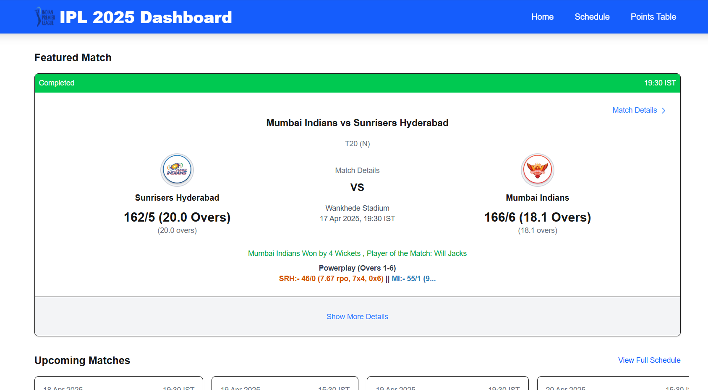

# IPL Dashboard 2025

A modern dashboard application for tracking the Indian Premier League (IPL) 2025 cricket tournament. Built with **Next.js**, **React**, **Zustand**, and **TypeScript**.


## Features

- **Live-Polling Match Updates**: Displays near real-time featured match information and scores fetched periodically via a central Zustand store.
- **Points Table**: Tracks team standings and detailed performance statistics.
- **Match Schedule**: View upcoming, live, and completed matches, filterable by status.
- **Detailed Match View**: In-depth page showing full scorecards (batting, bowling, extras, FOW) and visualization charts (Manhattan, Wagon Wheel) for individual matches.
- **Real-time Notifications**: Provides updates for new match events (via Match Notes) using:
  - In-app toasts (via **React Toastify**).
  - Optional **Browser Notifications** (requires user permission) for updates when the tab is inactive.
- **Centralized State Management**: Uses **Zustand** for efficient global state handling, data polling, and sharing across pages, minimizing redundant API calls.
- **Responsive Design**: Includes a mobile-friendly header/navigation and adapts content layout for various screen sizes.
- **Next.js & API Route**: Utilizes **Next.js App Router**. An API route (`/api/ipl-data`) handles fetching/consolidating summary data, while Server Components are used for the detail page.
- **Caching**: Implements Next.js fetch caching (`revalidate`) within the API route and server-side fetching functions to reduce load on external data sources.

Direct scraping of `iplt20.com` was not implemented due to potential complexities and fragility. Instead, this project utilizes publicly available JSON data feeds hosted on AWS S3, commonly associated with IPL statistics (e.g., `ipl-stats-sports-mechanic.s3.ap-south-1.amazonaws.com`).

## Screenshots

### Screenshot 1: Dashboard Home



### Screenshot 2: Match Details View


### Screenshot 3: Points Table


### Screenshot 4: Match Schedule


## Tech Stack

- **Framework**: Next.js (v15+) with App Router
- **Rendering**: Client Components (Home, Schedule, Points Table) using Zustand for state; Server Components (Match Detail)
- **UI Library**: React (v18+)
- **State Management**: Zustand
- **Charting**: Recharts
- **Language**: TypeScript
- **Styling**: Tailwind CSS
- **Notifications**: React Toastify, Browser Notification API
- **Data Fetching Strategy**: Client-side polling (via Zustand) + Server-side fetching (for detail page)

## Project Structure

```
ipl-dashboard/
├── src/
│ ├── app/ # App Router structure
│ │ ├── api/ # API routes
│ │ │ └── ipl-data/
│ │ │ route.ts # Endpoint fetching external summary data
│ │ ├── components/ # Reusable UI components
│ │ │ │ AppHeader.tsx
│ │ │ │ BattingScorecard.tsx
│ │ │ │ BowlingScorecard.tsx
│ │ │ │ FeaturedMatchCard.tsx
│ │ │ │ LoadingSpinner.tsx
│ │ │ │ PointsTableSection.tsx
│ │ │ │ UpcomingMatchesCarousel.tsx
│ │ │ └───charts/ # Chart-specific components
│ │ │ ManhattanChart.tsx
│ │ │ WagonWheelChart.tsx
│ │ ├── match/ # Match detail route
│ │ │ └── [matchId]/
│ │ │ page.tsx # Server component fetching match details
│ │ ├── points-table/ # Points table page
│ │ │ page.tsx # Client component consumes store
│ │ ├── schedule/ # Schedule page
│ │ │ matchCard.tsx # Component for schedule items
│ │ │ page.tsx # Client component consumes store, filters matches
│ │ ├── types/ # Shared TypeScript types
│ │ │ global.d.ts # Contains ScheduleMatch, PointsTable etc.
│ │ │ match-details.d.ts # Contains types for scorecards/charts
│ │ ├── utilities/ # App-level client components/hooks
│ │ │ IplDataInitializer.tsx # Triggers store polling
│ │ │ MatchNoteNotifier.tsx # Handles notification logic
│ │ ├── globals.css # Global styles
│ │ ├── layout.tsx # Root layout (includes Initializer, Notifier, Header, ToastContainer)
│ │ └── page.tsx # Home page (Client component consumes store)
│ ├── lib/ # Shared utilities/functions (outside app folder)
│ │ └── fetchMatchDetails.ts # Function to fetch detailed innings data
│ └── store/ # Zustand store definition (outside app folder)
│ └── iplStore.ts # Contains global state, actions, summary data fetching trigger
├── public/ # Static assets (e.g., icons, images)
│ └── IPL.png
│ └── icon-192x192.png # Example notification icon
├── next.config.js # Next.js configuration (incl. Image remotePatterns)
├── .eslintrc.json # ESLint configuration (or eslint.config.mjs)
├── tailwind.config.ts # Tailwind CSS configuration
├── tsconfig.json # TypeScript configuration
└── package.json # Project dependencies
```

## Getting Started

### Prerequisites

- **Node.js** 18.x or later
- **npm**, **yarn**, **pnpm**, or **bun**

### Installation

1.  Clone the repository:
    ```bash
    git clone https://github.com/Shreyas-Dayal/ipl-dashboard.git
    cd ipl-dashboard
    ```
2.  Install dependencies:
    ```bash
    npm install
    # or yarn install / pnpm install / bun install
    ```
3.  Run the development server:
    ```bash
    npm run dev
    # or yarn dev / pnpm dev / bun dev
    ```
4.  **Important**: Ensure the external IPL data sources used in `src/app/api/ipl-data/route.ts` and `src/lib/fetchMatchDetails.ts` are accessible and their format hasn’t changed significantly, as the parsing logic relies on specific structures.
5.  Open [http://localhost:3000](http://localhost:3000) in your browser to view the dashboard.

## State Management with Caching with Zustand

This project utilizes **Zustand** for efficient global state management of the frequently updated summary data:

- **Store**: Defined in `src/store/iplStore.ts`, it holds the application state (`data`, `loading`, `error`, `notificationPermission`).
- **Data Fetching Action**: The `fetchData` action within the store handles fetching summary data from the `/api/ipl-data` endpoint.
- **Initialization**: The `src/app/utilities/IplDataInitializer.tsx` component, placed in the root layout, triggers the initial `fetchData` call and sets up periodic polling via `setInterval`.
- **Consumption**: Client Components like the Home (`app/page.tsx`), Schedule (`app/schedule/page.tsx`), and Points Table (`app/points-table/page.tsx`) pages use the `useIplStore` hook to subscribe to relevant state slices and display data reactively.

## Notifications

The application provides notifications for new match events identified via `matchNotes`:

- **In-App Toasts**: Uses **React Toastify** to show brief notifications within the application window. The `ToastContainer` is included in the root layout.
- **Browser Notifications**: If the user grants permission, native browser notifications are displayed when the tab is inactive. Permission can be requested via UI elements.
- **Logic**: The `src/app/utilities/MatchNoteNotifier.tsx` component listens for changes in `matchNotes` from the Zustand store, compares them to the previous state (after initial load), and triggers notifications for newly added notes.

## Caching

To optimize performance and reduce load on external data sources, server-side caching is implemented:

- **Mechanism**: Utilizes Next.js's built-in `fetch` caching capabilities with time-based revalidation.
- **Implementation**: The `{ next: { revalidate: seconds } }` option is added to `fetch` calls within:
  - The `/api/ipl-data/route.ts` (for summary data feeds).
  - The `fetchAndParseInningsData` function in `lib/fetchMatchDetails.ts` (for detailed innings data).
- **Benefit**: Responses from the external S3 feeds are cached on the Next.js server for a configured duration (e.g., 60 seconds for summary, 1 hour for innings). Subsequent requests within this period receive the cached data instantly, speeding up API responses and page loads for the match detail view.

## Enhanced Data Visualization

The match detail page (`/match/[matchId]`) incorporates charts to provide visual insights into innings progression:

- **Library**: Uses **Recharts**, a composable charting library for React.
- **Charts Implemented**:
  - **Manhattan Chart**: Displays runs scored per over as bars, with visual indicators (dots) for wickets falling in an over.
  - **Wagon Wheel Chart**: Shows the direction and result (runs/boundary) of each shot played during the innings using lines radiating from a central point.
- **Components**: Dedicated components (`src/app/components/charts/ManhattanChart.tsx`, `src/app/components/charts/WagonWheelChart.tsx`) encapsulate the chart rendering logic. They are marked as Client Components (`"use client"`) as required by Recharts.

## Image Optimization

This project uses the **Next.js `<Image>`** component for optimized image loading:

- Always use `<Image />` from `next/image` instead of ``.
- Provide `width`, `height`, and `alt` props (or use `layout="fill"` with a sized parent).
- Configure `remotePatterns` in `next.config.js` for external image sources:

## API Reference

### GET `/api/ipl-data`

Fetches summary data from external IPL sources and returns a consolidated JSON response. Primarily used for polling updates for the main dashboard views.

- **Returns**:
  - `featuredMatch`: Details of the current or most relevant match (`ScheduleMatchRaw | null`).
  - `pointsTable`: Array of team standings (`PointsTableEntry[]`).
  - `schedule`: Array of weeks, each containing matches (`ScheduleWeek[]`).
  - `matchNotes`: Array of key events for the featured match (`MatchNote[]`).
- **Usage**: This endpoint is polled client-side by the Zustand store (`fetchData` action) to update the application's global state.

Example response snippet:

````json
{
  "featuredMatch": { /* ... ScheduleMatchRaw data ... */ },
  "pointsTable": [ { "TeamID": "14", "TeamName": "Delhi Capitals", ... } ],
  "schedule": [ { "date": "10 Apr 2025", "matches": [ /* ... ScheduleMatch array ... */ ] } ],
  "matchNotes": [ { "MatchID": "1825", "Description": "WICKET!", ... } ]
}

Example response snippet:

```json
{
  "featuredMatch": { "matchDetails": "..." },
  "pointsTable": [ { "TeamID": "14", "TeamName": "Delhi Capitals" } ],
  "schedule": [ { "date": "10 Apr 2025", "matches": [ ... ] } ],
  "matchNotes": [ { "MatchID": "1825", "Description": "WICKET!" } ]
}
````

(Note: The Match Detail page (/match/[matchId]) fetches its specific innings data directly from different external URLs via a server-side function in lib/fetchMatchDetails.ts, not this summary API.)

---

### Deployment

This application is optimized for deployment on **Vercel**. Follow these steps to deploy:

1. **Connect Your Git Repository to Vercel**
   - Sign in to [Vercel](https://vercel.com) and create a new project.
   - Link your Git repository to Vercel (GitHub, GitLab, or Bitbucket).
2. **Configure Environment Variables**

   - If your project requires environment variables, configure them in the Vercel dashboard.
   - This project currently uses **relative API paths**, so no environment variables are needed at this time.

3. **Build and Output Directory**

   - Vercel automatically detects the build command (`npm run build`) and output directory (`.next`).
   - If not, specify them in the Vercel dashboard.

4. **Deploy!**
   - Click the **Deploy** button, and your application will be live.

---

### Deployed Versions:

You can access the deployed versions of the dashboard here:

- [IPL Dashboard 2025 - https://ipl-dashboard-2k25.vercel.app/](https://ipl-dashboard-2k25.vercel.app/)
- [IPL Dashboard 2025 - https://ipl-dashboard-nu-seven.vercel.app/](https://ipl-dashboard-nu-seven.vercel.app/)

### Learn More

To dive deeper into the technologies used in this project, check out the following documentation:

- [Next.js Documentation](https://nextjs.org/docs)
- [React Documentation](https://reactjs.org/docs)
- [Zustand Documentation](https://github.com/pmndrs/zustand)
- [Tailwind CSS Documentation](https://tailwindcss.com/docs)
- [TypeScript Documentation](https://www.typescriptlang.org/docs)
- [React Toastify Documentation](https://fkhadra.github.io/react-toastify/introduction)
- [MDN - Notifications API](https://developer.mozilla.org/en-US/docs/Web/API/Notifications_API)

---

### License

This project is licensed under the **MIT License**.

---

### Author

Created by [Shreyas](https://github.com/shreyas).
